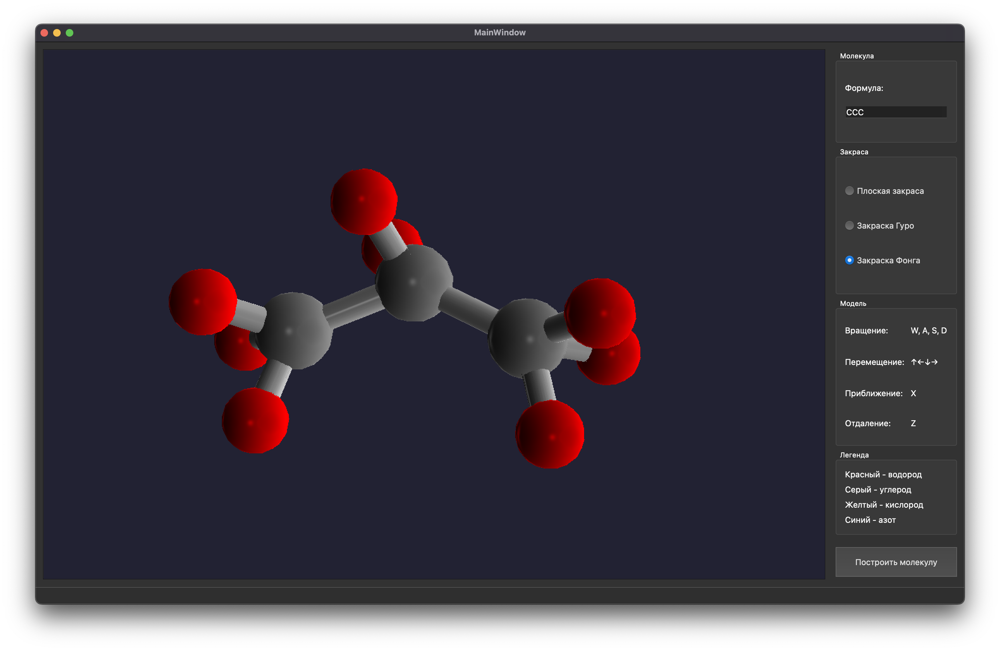
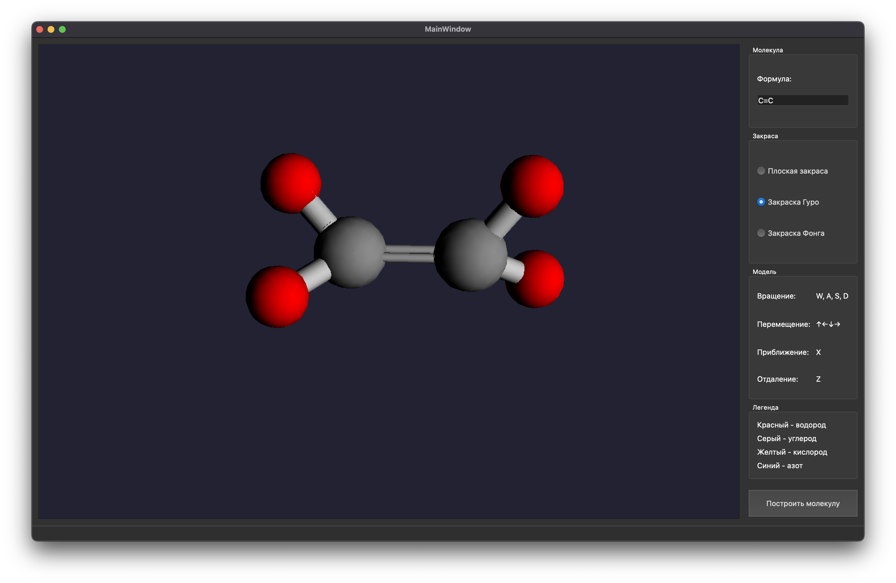
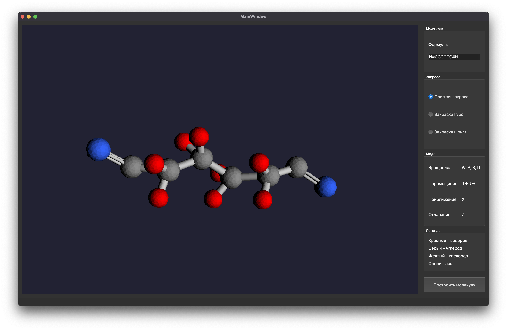

# 3DFluidSimulation
Программа позволяет задавать молекулу с помощью нотации SMILES. Пользователь может выбрать алгоритм закраски, который
будет применяться для отрисовки:
- закраска по Фонгу;
- закраска по Гуро;
- плоская закраска.

Для каждого атома определен свой цвет: 
- водород - красный; 
- углерод - cерый;
- кислород - желтый;
- азот - синий.

## Примеры 
### Молекула пропана (C3H8), закраска по Фонгу
Запись молекулы в нотации SMILES: ```CCC```


### Молекула этилена (C2H4), закраска по Гуро
Запись молекулы в нотации SMILES: ```C=C```


### Молекула адиподинитрила (C6H8N2), плоская закраска
Запись молекулы в нотации SMILES: ```N#CCCCCC#N```


## Компиляция 
```
mkdir build
cd build
cmake .. 
make
```